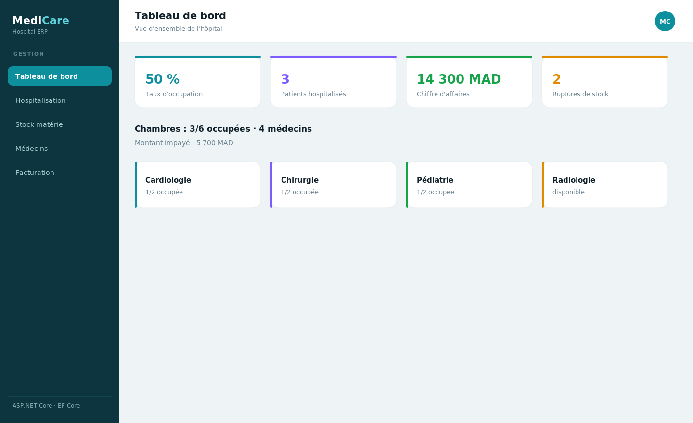
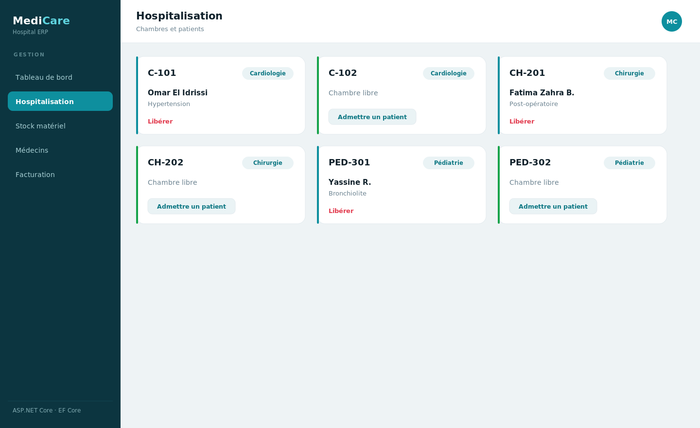
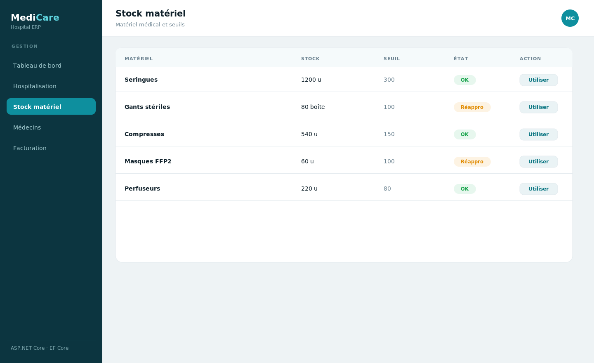
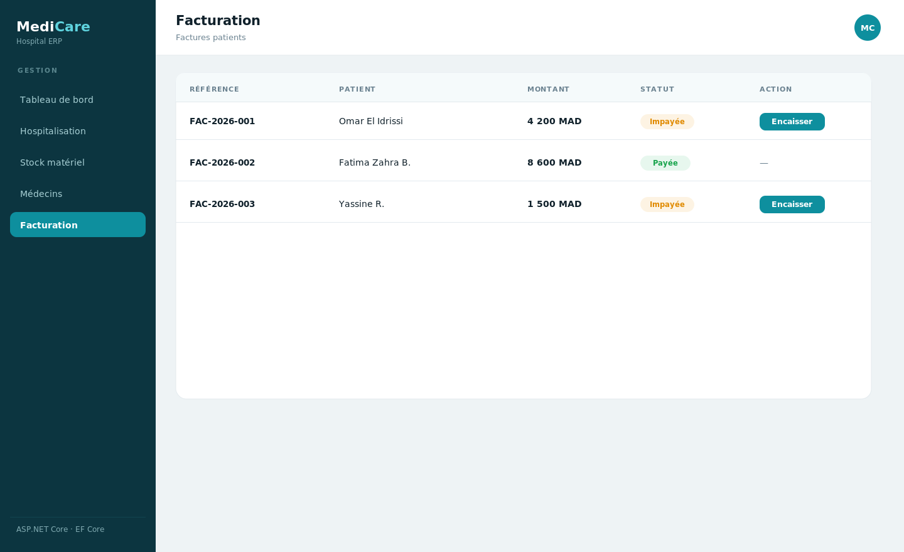

# MediCare — Gestion hospitalière

ERP de gestion d'hôpital : hospitalisation (chambres & patients), stock de matériel médical, médecins, et facturation. Backend **ASP.NET Core Web API** (**C#**, **Entity Framework Core**, **SQL Server**), frontend **React (Vite)**.

> Projet académique de Badr Chigar — Ingénieur d'État en Informatique (EMSI Casablanca).

## Captures d'écran

### Tableau de bord


### Hospitalisation (chambres)


### Stock de matériel


### Facturation


## Fonctionnalités
- **Hospitalisation** : chambres avec patient affecté, statut (libre / occupée), matériel utilisé.
- **Stock médical** : suivi des quantités, décrément automatique à l'affectation de matériel, alertes de seuil.
- **Médecins** : annuaire par spécialité.
- **Facturation** : génération et suivi du paiement des factures patients.
- **Tableau de bord** : taux d'occupation, patients hospitalisés, chiffre d'affaires, ruptures de stock.

## Stack
| Couche | Technologies |
|--------|--------------|
| Frontend | React 18, Vite, React Router |
| Backend | ASP.NET Core 8 Web API, C# |
| ORM | Entity Framework Core |
| Base de données | SQL Server (LocalDB / SQL Server) |

## Architecture
```
medicare/
├── backend/   API REST ASP.NET Core
│   ├── Program.cs
│   ├── Models/        Chambre, Patient, Materiel, Medecin, Facture
│   ├── Data/          MediCareContext (EF Core) + données de démo
│   ├── Dtos/          objets de requête
│   └── Controllers/   Chambres, Stock, Medecins, Factures, Stats
└── frontend/  SPA React (Vite)
    └── src/pages/  Dashboard, Hospitalisation, Stock, Medecins, Facturation
```

## Démarrage
### Backend (port 5000)
```bash
cd backend
dotnet restore
dotnet ef database update     # crée la base via EF Core (migrations)
dotnet run
```
> Par défaut : SQL Server LocalDB. Adapter `ConnectionStrings:Default` dans `appsettings.json`.
### Frontend (port 5173)
```bash
cd frontend && npm install && npm run dev
```

## Licence
MIT © Badr Chigar
